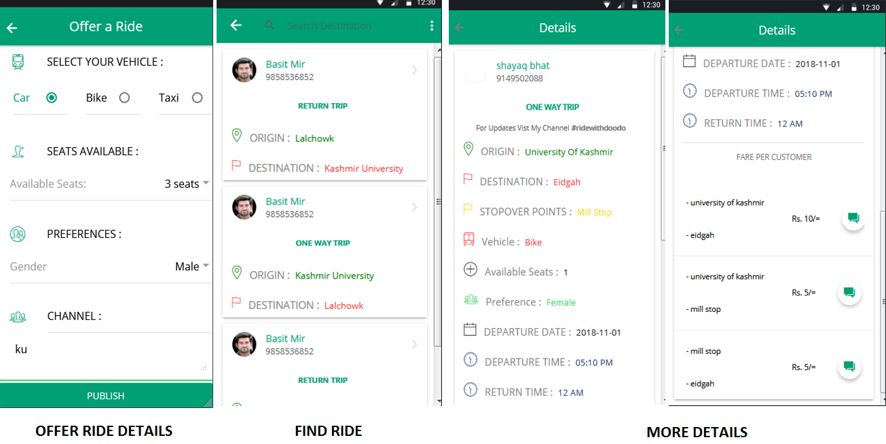
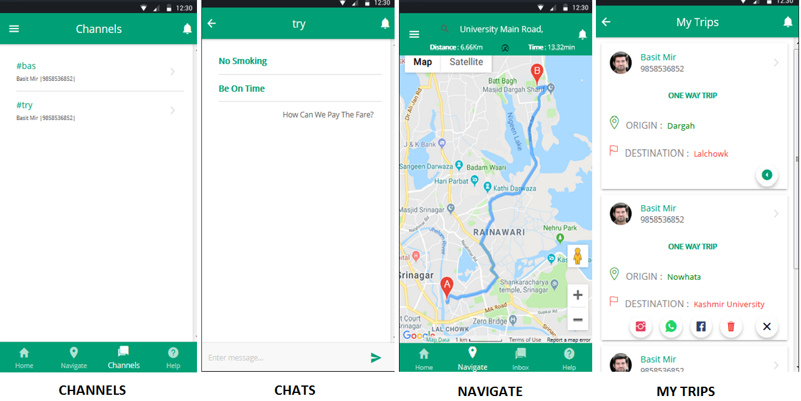

# shareMy-ride
Dynamic vehicle pooling and Ride-Sharing Application 
FRONT END : IONIC  
BACK END : FIREBASE 
NOTE : Run these cmds in your terminal  
       a) npm update  
       b) npm install rxjs@6.0.0 --save  
       c) npm install rxjs-compat@6.3.3 --s  
       d) Replace your firebase config details in firebase.credentials.ts 

  
